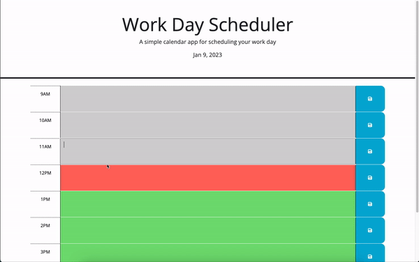

# work-day-scheduler

## Description
This is a JavaScript web app that was writing with Jquery library. It serves as a work day scheduler that allows the users to save tasks between 9AM & 5PM time slots. Time slots are colored coded which makes it easy to differentiate between past, present and future tasks. 

The webpage can be accessible through this link: 
https://darioelao.github.io/work-day-scheduler/

## Webpage Preview

## Usage
1. Load the webpage with the link provided above
2. Find a time slot with a desired time to write a task
3. Save the task with the "Disk Icon" located on the far right of each tme slot
4. Refresh the page to confirm task saves on the Local Storage